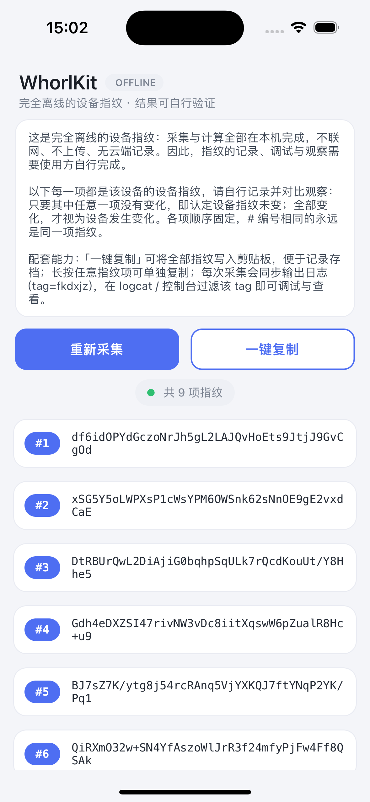

# WhorlKit · 完全离线的设备指纹

> Whorl /wɜːrl/，指纹的"涡纹"。
> 为每台设备产出一组完全离线计算的指纹串——不联网、不上传，结果可自行验证。
>
> **https://github.com/fkdwc/WhorlKit**

<p align="center">
  
</p>

个人项目放出来只有一个目的：**请大家来测试**——稳定性、唯一性、trace 采集行为，怎么测都欢迎。测出问题很正常，那正是最有价值的反馈。

## 设计目标

| # | 目标 | 什么情况说明未达成 |
|---|---|---|
| 1 | **稳定性**：同一设备经重启、重装 App、刷机、换网，指纹集合不变 | 同一设备在无真实硬件变化的前提下，产出完全不同的指纹集合（全部项都变） |
| 2 | **唯一性**：不同设备（含模拟器 / 云手机 / 克隆机）指纹互不相同 | 两台不同设备产出相同的指纹集合 |

**判定口径**：每台设备 N 项指纹，`#` 编号固定，编号相同即同一项；**任一项未变即指纹未变**，全部项变化才视为设备变化；一切计算在本机完成，无云端参与。

## 使用

### 安装

| 文件 | 平台 | 说明 |
|---|---|---|
| `WhorlKit-1.0.0-signed.apk` | Android | **已签名**，直接安装 |
| `WhorlKit-1.0.0.apk` | Android | 未签名（需用自有密钥签名时使用） |
| `WhorlKit-1.0.0.ipa` | iOS | 模拟器切片（arm64），无签名 |

**Android**（签名包，一步安装）：

```bash
adb install WhorlKit-1.0.0-signed.apk
adb shell am start -n com.jb.whorlkit/.MainActivity
```

手机直装：浏览器下载 `WhorlKit-1.0.0-signed.apk`，点开安装（允许"未知来源"一次），无需电脑。

**Android 自签**（可选，用未签名版）：

```bash
export PATH="$HOME/Library/Android/sdk/build-tools/35.0.0:$PATH"   # 版本按本机实际调整

keytool -genkeypair -v -keystore whorlkit.jks -alias whorlkit \
    -keyalg RSA -keysize 2048 -validity 10000

zipalign -f -p 4 WhorlKit-1.0.0.apk WhorlKit-aligned.apk
apksigner sign --ks whorlkit.jks --out WhorlKit-signed.apk WhorlKit-aligned.apk

adb uninstall com.jb.whorlkit   # 装过别的签名的旧版本需先卸载
adb install WhorlKit-signed.apk
```

**iOS 模拟器**（解压 IPA 后免签直装）：

```bash
xcrun simctl install booted Payload/MpsDfpIosApp.app
```

**iOS 真机自签**（可选，Apple 机制所限无免签路径）：

- 爱思助手：「工具箱 → IPA 签名」→ 导入 ipa → 登录 Apple ID（免费即可，建议把 Bundle ID 改成自己独有的）→ 签名安装 → 手机设置中信任证书；
- zsign：`zsign -c cert.p12 -p profile.mobileprovision -o signed.ipa WhorlKit-1.0.0.ipa`；
- 免费证书 7 天过期，重签即可。无 Mac 可用 Android 版，判定口径双端一致。

### 看指纹

- **界面**：首页逐项展示。「重新采集」重跑采集链；「一键复制」复制全部；长按单项可单独复制；
- **日志**（每次采集自动输出，tag = `fkdxjz`）：

```bash
# Android
adb logcat -s fkdxjz

# iOS 模拟器
xcrun simctl launch booted com.jb.whorlkit
xcrun simctl spawn booted log show --last 5m --predicate 'eventMessage CONTAINS "fkdxjz"'
```

输出形如（每项为定长哈希串，项数与内容以你的设备实际输出为准）：

```
# Android（logcat）
fkdxjz: device fingerprints: N items (tag=fkdxjz)
fkdxjz: #1: xxxxxxxxxxxxxxxxxxxxxxxxxxxxxxxxxxxxxxxxxxx
fkdxjz: #2: xxxxxxxxxxxxxxxxxxxxxxxxxxxxxxxxxxxxxxxxxxx

# iOS（unified log）
[fkdxjz] device fingerprints: N items
[fkdxjz] #1: xxxxxxxxxxxxxxxxxxxxxxxxxxxxxxxxxxxxxxxxxxx
```

### 测试流程

```
记录基线（一键复制 / 日志） → 执行测试（hook / 伪造 / 克隆 / 刷机…） → 重新采集 → 逐项对比
```

多设备对比同理：各取一份指纹，逐编号比对是否完全一致。

## 可以试的方向

- **Hook / 注入**：frida、xposed 等，hook 采集函数、篡改返回值；
- **Trace**：strace、frida-trace 跟采集行为，还原完整采集清单；
- **环境伪造**：改系统属性、伪装机型、篡改文件时间与各类标识符；
- **设备克隆**：模拟器快照、云手机镜像、整机迁移后对比；
- **常规扰动**：重启、恢复出厂、卸载重装、刷机、换网、时间回拨；
- **逆向**：产物经 native 层加固，欢迎分析。

测出问题或有想法，欢迎[提 Issue](https://github.com/fkdwc/WhorlKit/issues)：附设备 / 系统版本、复现步骤、测试前后两份指纹日志。

## 交流

做设备指纹相关的测试、评估、研究，欢迎联系（个人行为）：

- **风控 / 反欺诈**：指纹对抗测试、方案横向对比；
- **安全研究**：攻防、模拟器 / 云手机识别、克隆检测；
- **团队**：测试环境、评估用例、联合测试。

仓库为**离线测试版**；完整版 SDK 联网，含降级预案等工程稳定性手段，适合业务接入。联系方式：公众号私信 / 留言。

## FAQ

**为什么不联网？** 数据安全——测试不产生任何上传。完整版联网并含降级预案等稳定性手段，离线版只保留端上采集计算。

**指纹串能看出设备信息吗？** 定长哈希串，不暴露原始信息，只需关心"变没变"与"是否相同"。

**怎么知道它采集了什么？** 完全离线，自行 trace 系统调用与 API 即可完整还原采集清单。

**改了一部分项，算改掉指纹了吗？** 不算：任一项未变即指纹未变；两台设备所有项一致才算重复。

**能和其他方案对比吗？** 欢迎，同机同流程各自记录，欢迎分享对比数据。

## 版本

| 版本 | 日期 | 说明 |
|---|---|---|
| 1.0.0 | 2026-08-31 | 首个公开测试版：双端产物（签名/未签名 APK + 模拟器 IPA），展示 / 复制 / 日志输出（tag=fkdxjz） |
